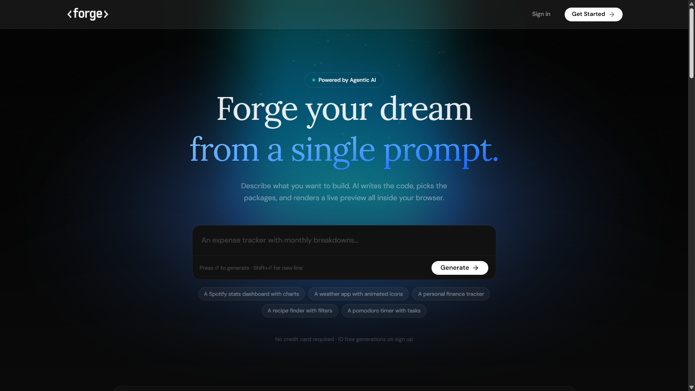
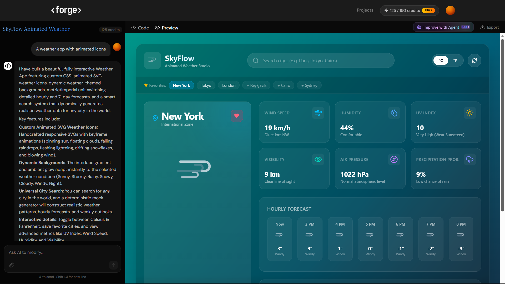

<div align="center">

# ⚒️ Forge AI

**Describe an app. Get production-ready React code — instantly, live, and editable.**

Forge AI is a full-stack, AI-powered application builder that turns natural language prompts into complete, multi-file React projects — with a live sandboxed preview, streaming AI chat, and persistent workspaces.



[**Live Demo →**](https://forge-vbv18.vercel.app/)


</div>

---

## ✨ What It Does

Forge AI lets you go from an idea to a working React app in one prompt:

- **Prompt → App** — Describe what you want to build; Forge generates a complete, structured multi-file React project.
- **Live Sandbox Preview** — Generated code renders instantly in an in-browser sandbox (Sandpack) — no build step, no local setup.
- **Streaming AI Chat** — Watch code generate token-by-token via a streaming pipeline, not a spinner-then-dump.
- **Image-Assisted Prompting** — Attach a reference image and the AI incorporates it directly into the generated UI.
- **AI Code Improvement** — Ask Forge to refine, extend, or fix existing generated code in follow-up turns, with full project context passed back to the model.
- **Persistent Workspaces** — Every project, its chat history, and its file tree are saved and resumable — nothing is lost on refresh.
- **Credit & Plan System** — Usage-based credits tied to `free` / `starter` / `pro` plans, enforced server-side on every generation.
- **Auth & Abuse Protection** — Clerk-based authentication and Arcjet rate limiting protect the API from abuse and unauthenticated access.


---

## 🧠 How It Works

1. **User sends a prompt** (optionally with an image) from the chat panel.
2. The **last 10 messages are trimmed and windowed** server-side to keep context lean, and the **current project's file tree is injected** into the final message for grounded, context-aware generation.
3. The prompt is sent to **Gemini** via the Google GenAI SDK / Vercel AI SDK, which streams back structured, multi-file code.
4. Streamed output is parsed into a file map and rendered live in a **Sandpack** sandbox — instant preview, zero server-side build.
5. The full conversation and generated file tree are persisted to **Postgres (Supabase)** via **Prisma**, so every workspace survives a refresh or new session.
6. Every generation call is **rate-limited (Arcjet)**, **authenticated (Clerk)**, and **debited against the user's credit balance** before it reaches the model.

---

## 🏗️ Tech Stack

| Layer | Technology |
|---|---|
| **Framework** | Next.js 16 (App Router), React 19, TypeScript |
| **AI / Generation** | Google Gemini API, Vercel AI SDK, `@google/genai` |
| **Live Code Execution** | Sandpack (CodeSandbox) |
| **Database / ORM** | PostgreSQL (Supabase), Prisma 7 |
| **Auth** | Clerk |
| **Security** | Arcjet (rate limiting & bot/abuse protection) |
| **Styling / UI** | Tailwind CSS 4, shadcn/ui, Radix (Base UI), Framer Motion |
| **Deployment** | Vercel |

---

## 🗂️ Architecture Highlights

- **Route handlers as AI orchestration layers** — `/api/gen-ai` and `/api/improve` own the full request lifecycle: auth check → rate limit → credit check → context assembly → streamed model call → persistence.
- **Schema-driven multi-tenancy** — a `User ↔ Workspace` relational model (Prisma) with per-user credit balances and plan tiers, indexed for fast workspace lookups.
- **Context-window management** — custom message-trimming logic keeps long chat histories within token limits without losing early project context.
- **Client/server split for real-time feel** — server does auth, persistence, and model orchestration; client owns the Sandpack sandbox and streaming UI updates.

---

## 🚀 Getting Started

```bash
git clone https://github.com/vbv18/Forge.git
cd Forge
cp .env.sample .env   # fill in Clerk, Supabase, Arcjet, and Gemini keys
npm install
npm run dev
```

### Environment Variables

```env
# Clerk
NEXT_PUBLIC_CLERK_PUBLISHABLE_KEY=
CLERK_SECRET_KEY=

# Supabase / Postgres
DATABASE_URL=
DIRECT_URL=
NEXT_PUBLIC_SUPABASE_URL=
NEXT_PUBLIC_SUPABASE_ANON_KEY=

# Arcjet
ARCJET_KEY=

# Gemini
GOOGLE_GENERATIVE_AI_API_KEY=
```

---

## 📌 Roadmap

- [ ] Export generated projects as downloadable, deployable repos
- [ ] Multi-model support (fallback across providers)
- [ ] Real-time collaborative workspaces
- [ ] Version history / rollback for generated projects

---

<div align="center">

Built with ❤️ by vbv18 using Next.js and the Gemini API

</div>
